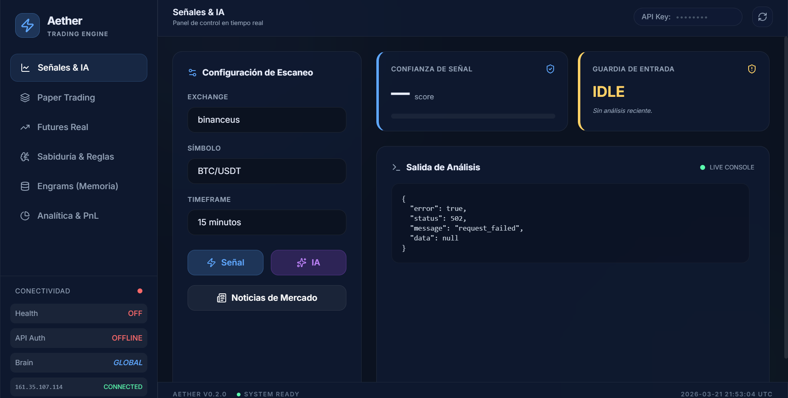

# Trading Bot Telegram

Bot de Telegram en Node.js para utilidades de trading (integración con exchanges vía CCXT y automatizaciones).

## Uso rápido

```bash
npm ci
cp .env.example .env
npm start
```

## Despliegue

Ver [DEPLOY.md](DEPLOY.md).

## API privada (para tu web/Vercel)

Este repo incluye una API HTTP simple para consumir desde tu web (por ejemplo un dashboard en Vercel).

Variables en `.env`:

- `TRADING_BOT_API_KEY`: token para `Authorization: Bearer ...` (por defecto usa `AETHER_2026`)
- `TRADING_BOT_API_HOST` / `TRADING_BOT_API_PORT`
- `TRADING_BOT_API_ALLOWED_ORIGINS`: lista separada por comas (solo si llamas desde el navegador)

Arranque:

```bash
npm run api
```

Endpoints principales:

- `GET /health` (Estado del servidor)
- `GET /api/meta` (Metadatos y estado de autorización)
- `GET /api/news` (Noticias de mercado y sentimiento IA)
- `POST /api/signal` (Análisis técnico y señales)
- `POST /api/ai` (Análisis avanzado con DeepSeek IA)
- `GET /api/paper/positions` (Gestión de trades simulados)
- `GET /api/paper/trades?limit=100` (Historial de resultados)

Recomendación para Vercel: no expongas `TRADING_BOT_API_KEY` al navegador; úsalo en un endpoint server-side (route handler) que haga proxy hacia esta API.

### UI Dashboard (Panel Visual)

Este repo incluye una UI profesional en `public/index.html` con las siguientes características:

- **Vista Dual de Análisis**: Noticias de mercado en tiempo real junto con gráficos dinámicos de TradingView.
- **Sentimiento del Mercado**: Análisis automático de titulares usando IA para determinar la política de trading (Neutral, Crisis, etc.).
- **Monitoreo de VPS**: Estado de conectividad, Uptime y servicios en tiempo real.
- **Gestión de Paper Trading**: Abre, cierra y monitorea posiciones simuladas desde el panel.
- **Responsive Design**: Optimizado para móviles y escritorio con scroll independiente en secciones de análisis.

Para desplegar la UI:
1. Sube los archivos a tu servidor (ver [DEPLOY.md](DEPLOY.md)).
2. Accede vía web a tu servidor en el puerto configurado (ej. `http://tu-ip:8787`).
3. Usa la API Key configurada para desbloquear las funciones.

### UI en Cloudflare Pages (visual)

Este repo incluye una UI estática en `public/` y un proxy server-side en `functions/` para Cloudflare Pages, para que tengas un apartado visual sin exponer tokens en el navegador.

En Cloudflare Pages:

- Build command: vacío
- Output directory: `public`
- Environment Variables (para Pages Functions):
  - `BOT_API_BASE_URL=https://api.tu-dominio.com`
  - `BOT_API_KEY=<mismo token que TRADING_BOT_API_KEY>`

La UI queda en `https://<tu-proyecto>.pages.dev/` y consume:

- `POST /api/signal`
- `GET /api/paper/positions`
- `GET /api/paper/trades?limit=100`

Si quieres un dominio propio (ej. `web.tu-dominio.com`), agrega un Custom Domain en Cloudflare Pages y sigue el asistente de DNS/TLS.

### Proxy en Vercel

Este repo incluye endpoints serverless en `api/` para usar Vercel como “puente” y así no filtrar el token al navegador.

En Vercel (Project Settings → Environment Variables):

- `BOT_API_BASE_URL`: URL pública de tu servidor (ej. `https://api.tu-dominio.com`)
- `BOT_API_KEY`: el mismo valor que `TRADING_BOT_API_KEY` en tu servidor

Luego, desde tu web, llama a tu dominio de Vercel:

- `POST https://<tu-app>.vercel.app/api/signal`
- `GET https://<tu-app>.vercel.app/api/paper/positions`
- `GET https://<tu-app>.vercel.app/api/paper/trades?limit=100`

Para publicar el dominio `api.tu-dominio.com` sin abrir puertos en el servidor: ver [CLOUDFLARE.md](CLOUDFLARE.md).

## Bots (referencia)

| Bot | Lenguaje | Enfoque Principal | Dificultad |
| --- | --- | --- | --- |
| Freqtrade | Python | Estrategias técnicas / ML | Media |
| Hummingbot | Python/C++ | Arbitraje / Market Making | Alta |
| OctoBot | Python | Multiestrategia / IA | Baja-Media |
| Jesse | Python | Backtesting preciso | Media |
